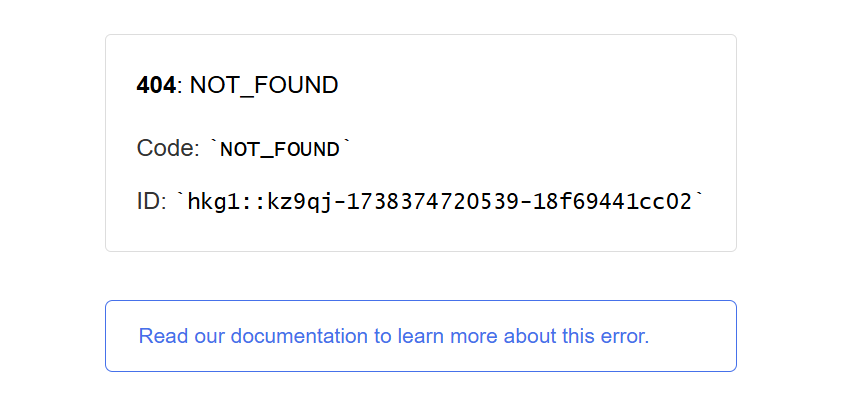

## 今日起左個新 ReactJS Project

諗住練習一下 Front End Skill。  
Local run 到無問題，但 deploy 左去 Vercel 上面便出現 `404 Page Not Found` issue。  



### 解決方法

在 root folder 上加 `vercel.json`，之後係入面加返個 rewrite rule 便以了：
```json
{
"rewrites": [{ "source": "/(.*)", "destination": "/" }]
}

```

Hope you find it useful