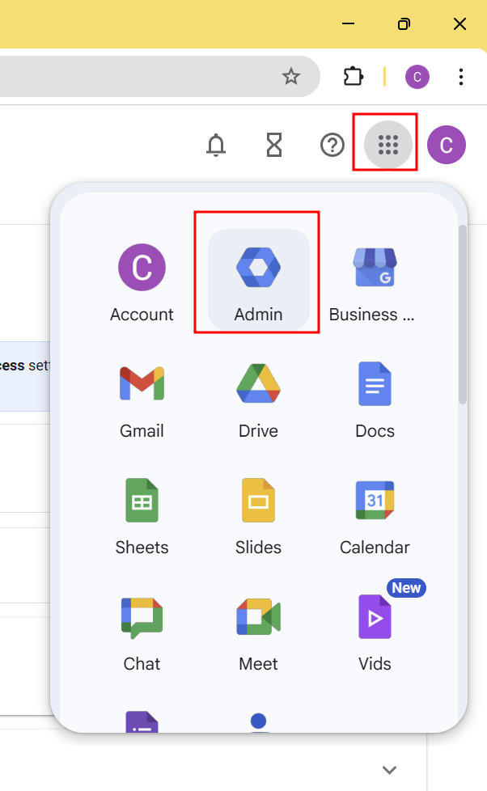
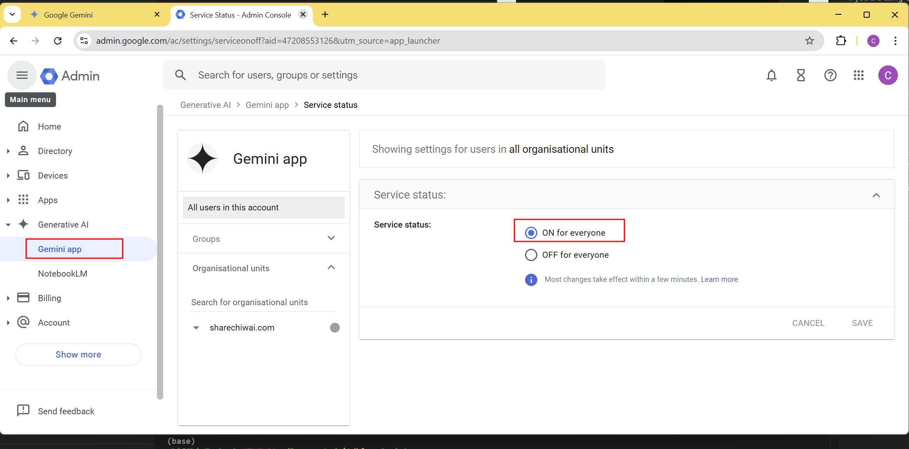

## 在香港使用 Google Gemini

當你嘗試在香港使用 Google Gemini 時，你可能會看到地區限制的頁面，如下圖所示：

### 解決方法

如果你是 **Google Workspace** 的用戶，你可以輕鬆繞過這些限制，並自由g地使用 **Google Gemini**。

以下是一些步驟，幫助你在地區限制的情況下使用 **Google Gemini**：

1. 確保你已經擁有 **Google Workspace** 帳戶。
2. 點擊 **Gmail** 中的應用程式圖示，選擇「**Google Workspace Admin Console**」

   

3. 在「**Google Workspace Admin Console**」 選擇「**Generative AI**」和「**Gemini app**」，以啟用 **Gemini**（如果尚未啟用）。

   

4. 登錄你的 **Google Workspace** 帳戶，並嘗試再次訪問 **Google Gemini**。

這樣，你就可以在香港或其他地區限制的地方使用 **Google Gemini** 了！
