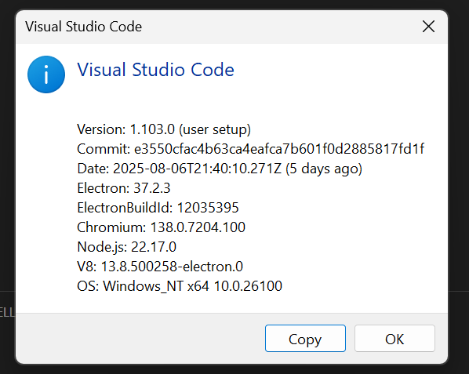
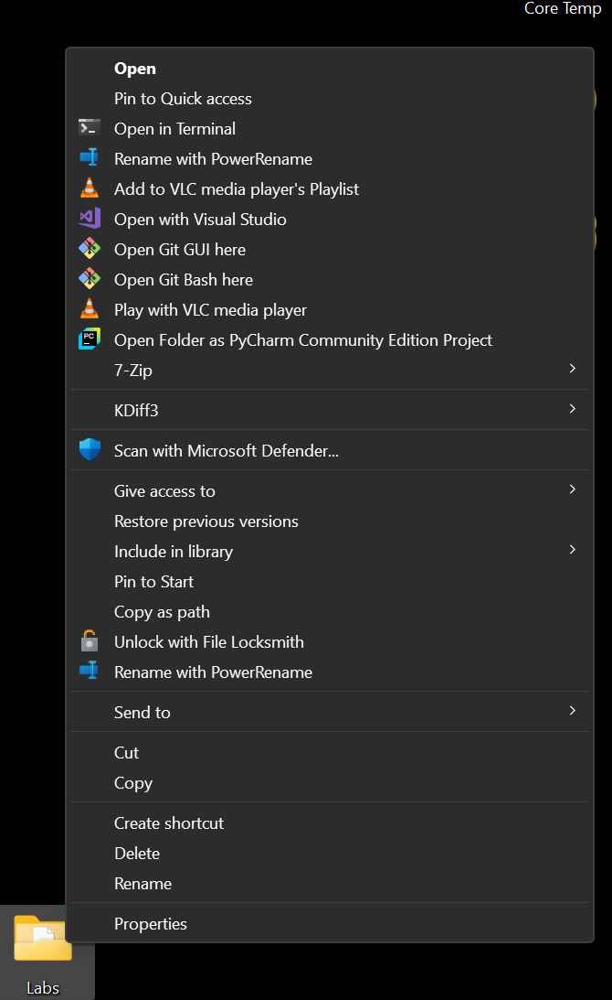
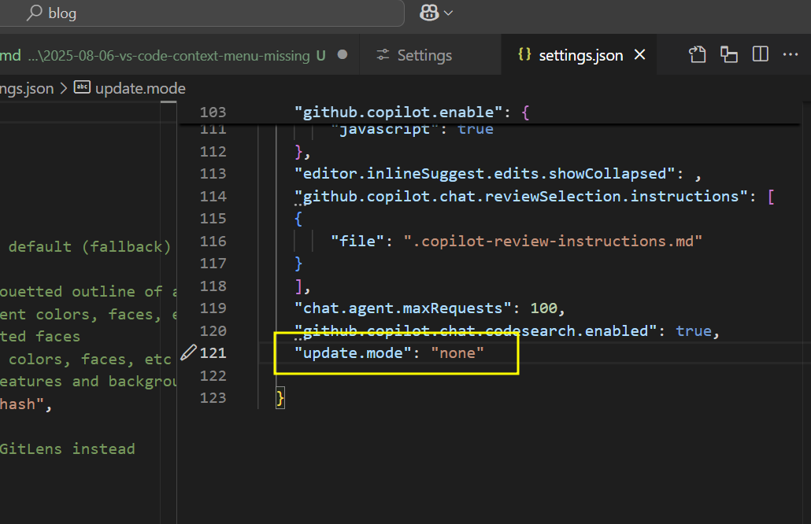
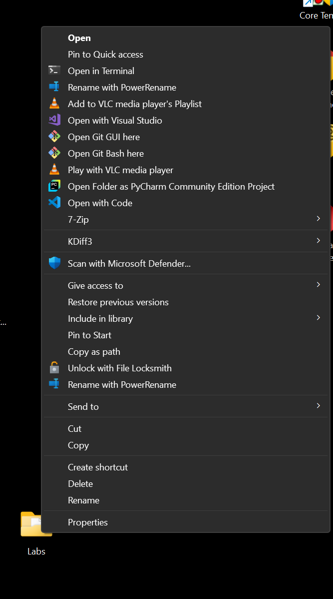

## VS Code 右鍵選單消失問題及解決方法

啱啱自動更新咗 **VS Code**（v 1.103）！



平時用開喺 folder 上面按右鍵，打算用 context menu 喺 VS Code 開啟資料夾，但係今次發現 context menu 唔見咗...



原來係 **VS Code** 更新嘅問題，要等下一個 update 先至 fix 得到。

不過網上有啲 workaround，可以安裝上一個 version 嘅 VS Code，並且停用自動更新。如果你開咗自動更新，重啟 VS Code 嘅時候好可能會自動升級返最新 version。

**Download VS Code v1.102**
[https://code.visualstudio.com/updates/v1_102](https://code.visualstudio.com/updates/v1_102)

大家可以去 VS Code **Preference → Settings**，更新 `user settings` 去停止自動更新。

喺 `settings.json` 加入以下設定：

```jsonc
"update.mode": "none"
```


咁就可以避免 VS Code 自動更新，等官方 fix 咗先再升級！



Hope you find it useful