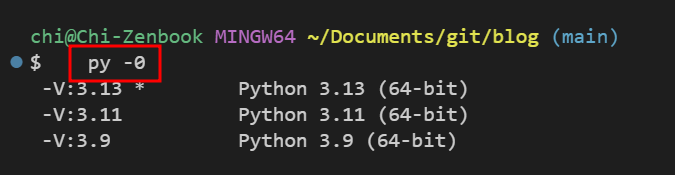

在寫 Python 或部署小工具時，常常需要知道電腦上到底安裝了哪些 Python 版本。


那麼怎樣才知道系統上安裝了哪些 Python 版本呢？

**解決放法:**
```bash
py -0
```
這個指令會列出所有安裝在系統上的 Python 版本。


如果想check 現在python 版本，可以用以下指令:
```bash
python --version
```

Hope you find it useful!

