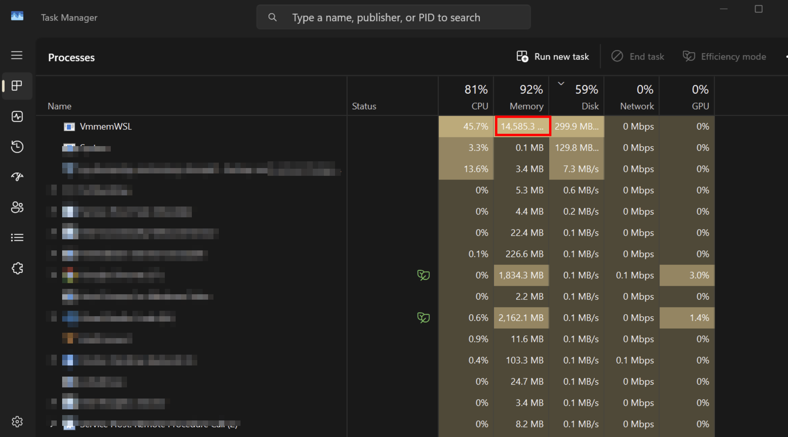
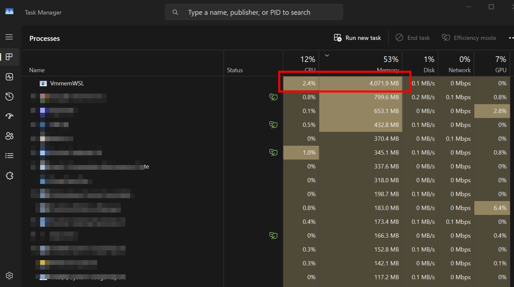
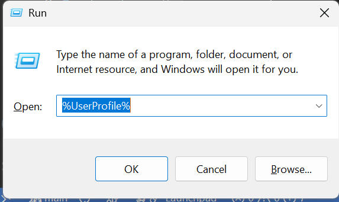

今日做做下野時發現部 Asus S13 32GB RAM 既 laptop 有 D lag，睇下 task manager 就發現 `VMmemWSL` 佔用咗大約 **14GB** 既 RAM。

係 Windows 機遇到呢 D 問題通常都會 restart 部機睇下會唔會解決到...



點知 restart 完之後一開 docker `VMmemWSL` 都用咗 **4GB** RAM，無乜點做野都無左 4GB。



問左 Gemini 佢話通常因為有 DB 既機係 Docker 會自己 allocate 大量 RAM。

但係我又無真係用緊佢都用咁多 RAM...

再做左 D 資料搜集，發現原來係 **Docker Desktop + WSL2** 既問題，佢會自己 allocate 大量 RAM 俾 WSL2 用。

## 解決方法

`Win+R` `"%%USERPROFILE%%"` 打開 User Folder，睇下有無一個 `.wslconfig` file。

無就 create 一個 `.wslconfig` file，入面加以下內容：



```ini
[wsl2]
memory=4GB # Limits VM memory in WSL 2 to 4 GB
processors=4 # Makes the WSL 2 VM use two virtual processors

[experimental]
autoMemoryReclaim=gradual # Enables gradual memory reclaiming, which allows WSL 2 to release unused memory back to the host system over time
```

咁就可以限制 WSL2 用最多 **4GB** RAM，同埋開啟 **gradual memory reclaiming** 功能，讓 WSL2 可以隨時釋放未使用的記憶體回主機系統。

Save 完之後重啟部機，再開 docker 就會見到 `VMmemWSL` 只係用左大約 **4GB** RAM，唔會再有之前咁大既 RAM usage 啦。


Hope you find it useful
