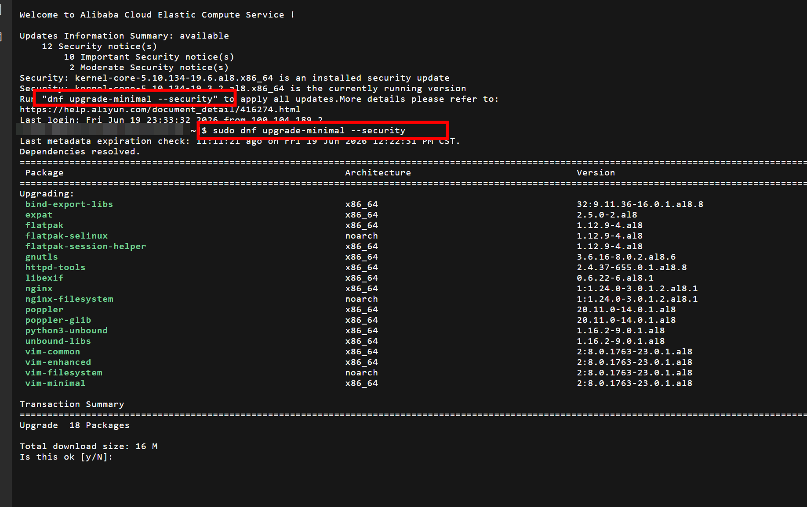
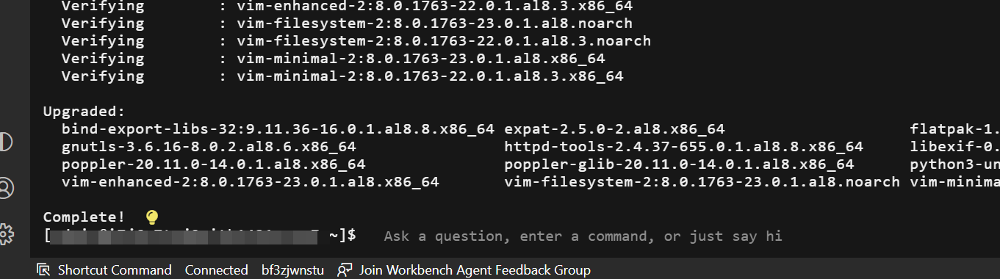
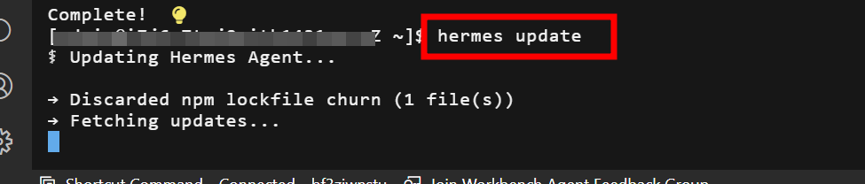
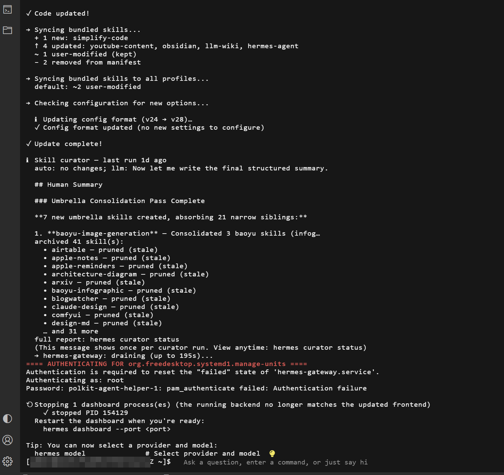
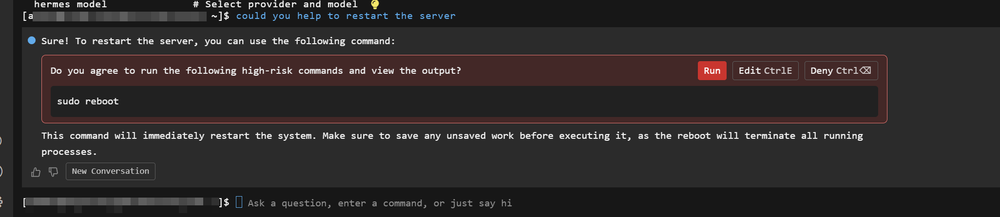

最近試咗喺 AliCloud Simple Application Server 上面 deploy Hermes Agent，個過程非常簡單，跟住 wizard 做便可。以下係一啲我久唔久要維護嘅筆記。

## Simple Application Server Security Patch

每次登入 AliCloud Simple Application Server 會有機會見到一個提示話有 security patch 可以 update，建議大家見到都去 update，保持系統安全。

```bash
sudo dnf upgrade-minimal --security
```



很快便完成：



## 更新 Hermes Agent

因為 Hermes Agent 會定期有更新，建議大家定期 check 下有冇新版本，保持 agent 最新，確保功能同埋安全性。

```bash
hermes update
```



完成更新：



## 重啟 Server

完成所有更新後可以重啟呢個 Simple Application Server，確保所有更新都生效。

```bash
sudo reboot
```

AliCloud Simple Application Server 入面有個 AI 功能，可以等好似我一樣嘅新手問問題，之後佢會幫你解答，真係幾方便，唔洗成日上網搵資料。



Hope you find it useful!