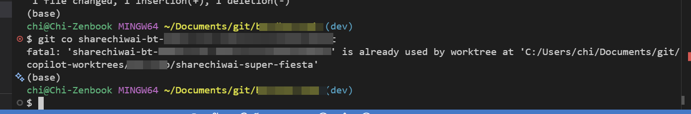

最近常常使用 GitHub Copilot App 去幫我執行 Hermes Agent 幫我 create 既 JIRA Task, 當Githut Copilot App 執行完, 建立了 Pull Request 之後我想係working folder 上試下個 pull request 時往往都係會出現這個 error message, 唔比我checkout 這個branch



```
fatal: 'sharechiwai-task-1' is already used by worktree at 'C:/Users/chi/Documents/git/copilot-worktrees/frontend/sharechiwai-super-fiesta'
```

## 點解會出現這個錯誤？

GitHub Copilot 使用 **git worktree** 功能嚟為每個 task 建立獨立嘅工作目錄。Git worktree 允許你同時 checkout 多個 branch 到唔同嘅目錄，但有一個限制：**同一個 branch 唔可以同時被多個 worktree checkout**。

當你嘗試喺 main working folder checkout 同一個 branch 時，Git 就會報呢個錯誤，因為個 branch 已經被 Copilot 建立嘅 worktree 佔用咗。

## 解決方案

### 方法一：刪除 Copilot 建立嘅 worktree

如果你唔再需要 Copilot 嘅 worktree，可以刪除佢：

```bash
# 列出所有 worktree
git worktree list

# 刪除特定 worktree
git worktree remove C:/Users/chi/Documents/git/copilot-worktrees/frontend/sharechiwai-super-fiesta

# 如果 worktree 目錄已經唔存在，用 prune 清理
git worktree prune
```

刪除 worktree 之後，你就可以正常 checkout 個 branch 啦。

### 方法二：直接喺 Copilot worktree 入面工作

如果你想在 Copilot 建立嘅環境繼續工作，可以直接 cd 入去個 worktree 目錄：

```bash
cd C:/Users/chi/Documents/git/copilot-worktrees/frontend/sharechiwai-super-fiesta
```

咁樣你就可以喺嗰度繼續開發，唔使 checkout branch。

### 方法三：Checkout 到另一個 branch

如果你只想喺 main working folder 做其他嘢，可以 checkout 去另一個 branch：

```bash
git checkout main
# 或者 checkout 去其他 branch
git checkout another-branch
```

### 方法四：使用 --ignore-other-worktrees 參數

如果你確實需要喺 main working folder checkout 個 branch，可以用 `--ignore-other-worktrees` 參數強制 checkout：

```bash
git checkout --ignore-other-worktrees sharechiwai-task-1
```

呢個方法會忽略其他 worktree 嘅衝突，直接 checkout 個 branch。不過要小心，因為咁樣會導致同一個 branch 同時被多個 worktree checkout，可能會引起衝突問題。建議只係短暫使用，完成工作後盡快清理 worktree。

## 預防方法

為咗避免呢個問題，建議：

1. **完成 task 後清理 worktree**：當 Copilot 完成 task 並且你已經 merge 咗 PR，記得刪除相關嘅 worktree
2. **定期 prune worktree**：用 `git worktree prune` 清理已經唔存在嘅 worktree 引用
3. **用 `git worktree list` 檢查**：checkout branch 之前先檢查下有冇其他 worktree 用緊個 branch

## 總結

呢個錯誤係因為 Git worktree 嘅限制做成嘅。GitHub Copilot 用 worktree 嚟隔離唔同 task 嘅工作環境，但當你想喺 main working folder 用同一個 branch 時就會衝突。最簡單嘅解決方法就係刪除唔再需要嘅 worktree，或者直接用 Copilot 建立嘅 worktree 目錄繼續工作。

## 延伸閱讀

如果你想了解點樣批量清理已合併嘅 worktree，同埋點樣用腳本自動化清理過程，可以參考 [Git Worktree Cleanup Guide](/post/2026/2026-03-18-git-worktree-cleanup-guide/)。
